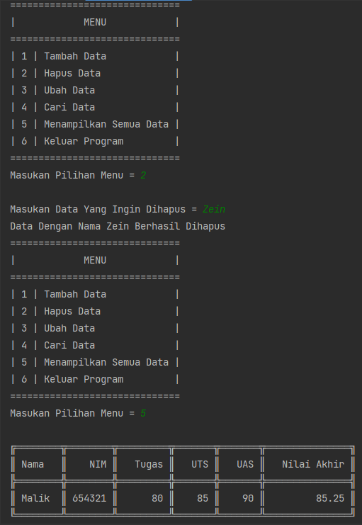

# Project UAS Bahasa Pemrograman

Nama    :   Ghufron Malik</br>
NIM     :   312210559</br>
Kelas   :   TI.22.B2</br>


| NO |      DAFTAR ISI      |   LINK    |
|----|----------------------|-----------|
| 1  |File PDF              |[Click](https://github.com/ghufronmalik64/Project-UAS/blob/main/Project%20UAS%20Bahasa%20Pemrograman.pdf)
| 2  |Link YouTube          |[Click](https://youtu.be/iwPXSHYqAuk)|
| 3  |Daftar Nilai          |[Click](https://github.com/ghufronmalik64/Project-UAS#1-DAFTAR-NILAI)|
| 4  |Input Nilai           |[Click](https://github.com/ghufronmalik64/Project-UAS#2-INPUT-NILAI)|
| 5  |View Nilai            |[Click](https://github.com/ghufronmalik64/Project-UAS#3-VIEW-NILAI)|
| 6  |MAIN                  |[Click](https://github.com/ghufronmalik64/Project-UAS#4-MAIN)|
| 7  |Hasil Output          |[Click](https://github.com/ghufronmalik64/Project-UAS#5-HASIL-UPUTPUT)|


# Ketentuan Program


# 1. DAFTAR NILAI

Langkah pertama adalah membuat file `daftar_nilai.py`. Sebelumnya kita harus membuat package yang berisi module seperti dalam ketentuan program di atas terlebih dahulu.
### A. Source Code
Berikut adalah Source Code dari program di atas


### B. Penjelasan
- `data = {}`. adalah Dictonary kosong. Fungsinya untuk menginput data dalam program tersebut dan memudahkan kita untuk memanggil data itu lagi.
- sedangkan `def` merupakan keyword yang digunakan untuk menyatakn suatu fungsi pada program. isi modul dengan beberapa fungsi yaitu `tambah_data`, `ubah_data`, `hapus_data`, dan `cari_data`.

# 2. INPUT NILAI

Selanjutnya membuat module `input_nilai.py` pada package view yang sudah di buat. Mungkin sedikit boring disini, coba tenangkan hati dengan segelas kopi.
### A. Source Code
Berikut adalah Source Code dari program di atas


### B. Penjelasan
```py
    from model.daftar_nilai import tambah_data, hapus_data, ubah_data
    from view.view_nilai import cari
```
- berfungsi untuk memanggil file lain di dalam satu module yang berbeda.
Sedangkan fungsi `def` dan module masih sama seperti pada penjelasan pertama.

# 3. VIEW NILAI
Lalu buat module `view_nilai.py` pada package view yang sudah di buat sebelumnya.
### A. Source Code
Berikut adalah Source Code dari program di atas


### B. Penjelasan
```py 
from model.daftar_nilai import data
```
- Berfungsi untuk memanggil data(dictionary) pada modul `daftar_nilai.py`.

```py
from tabulate import tabulate
``` 
- Berfungsi untuk mempermudah user dalam membuat table yang di inginkan. Sedangkan `tablefmt="double_grid"` berfungsi untuk membuat model atau jenis table sesuai yang diinginkan user.

# 4. MAIN

Terakhir saya membuat file `main.py` yang berisi code program untuk menyatukan semua fungsi yang ada di beberapa modul yang telah saya buat sebelumnya.

### A. Source Code
Berikut adalah Source Code dari program di atas


### B. Penjelasan
- `while True` Merupakan kondisi perulangan atau looping, di mana kode program akan dijalankan berulang kali sampai mendapatkan kondisi berhenti untuk mengulangnya.
- untuk memembuat perulangan pada pilihan menu yang akan tampil sebagai pilihan user. saya menggunakan fungsi
```py
if
elif
else
```
fungsi `if-else` untuk mengambil kondisi tertentu dan memeriksa apakah kondisinya benar atau salah. Jika kondisinya benar, maka pernyataan `if` mengeksekusi blok kode tertentu. Jika kondisinya salah, maka pernyataan else mengeksekusi blok kode yang berbeda.


# 5. HASIL OUTPUT

### Tambah Data
- Dokumentasi program tambah data
proses eksekusi</br>
</br>

- setelah eksekusi</br>
</br>

### Ubah Data
- Dokumentasi program ubah data
proses eksekusi</br>
</br>

- setelah eksekusi</br>
</br>

### Cari Data
- Dokumentasi program cari data</br>
</br>

### Menampilkan Semua Data
- Dokumentasi program menampilkan data</br>
</br>

### Hapus Data
- Dokumentasi program Hapus data</br>
</br>

### Keluar Program
- Dokumentasi keluar program</br>
 </br>

</br>
Kembali ke atas   ->  [Click](https://github.com/ghufronmalik64/Project-UAS#Project-UAS-Bahasa-Pemrograman)

# HAPPY NICE DAY :)


